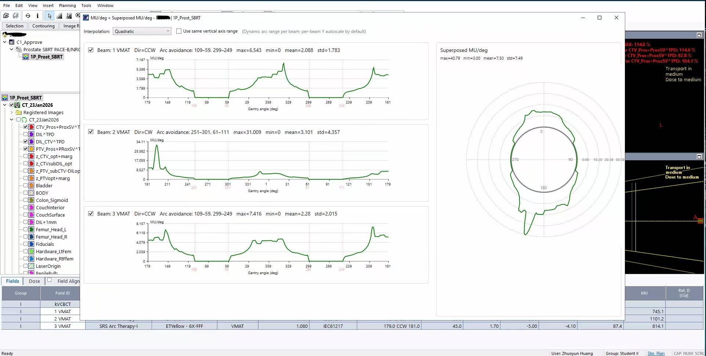

# Arc Analysis for Eclipse ESAPI

Interactive Eclipse ESAPI tool for VMAT arc analysis with MU/degree visualization, superposed polar plots, and automatic arc avoidance detection.

---

## Overview

This application provides a graphical interface for analyzing VMAT treatment plans in Varian Eclipse. It computes beam-specific MU/degree distributions, generates combined polar visualizations, and identifies inactive arc segments to support treatment plan evaluation and quality assurance.

---

## Features

- Interactive WPF graphical interface
- Per-beam MU/degree analysis
- Superposed MU/degree polar visualization
- Automatic arc avoidance detection
- Linear and quadratic interpolation
- Beam-specific statistics (maximum, minimum, mean, standard deviation)
- Optional shared Y-axis scaling for beam comparison

---

## Example

The figure below shows the graphical interface displaying per-beam MU/degree analysis and the combined polar visualization for a representative VMAT treatment plan.

---

## Technologies

- C#
- Varian Eclipse Scripting API (ESAPI)
- Windows Presentation Foundation (WPF)
- .NET Framework

---

## Requirements

- Varian Eclipse Treatment Planning System
- Eclipse Scripting API (ESAPI)
- Compatible .NET Framework

---

## Disclaimer

This software is provided for research and educational purposes only. It has not been validated for clinical use and should be independently verified before being incorporated into any clinical workflow.

---

## Author

**Zhuoyun Huang**

Medical Physics PhD Student  
University at Buffalo
